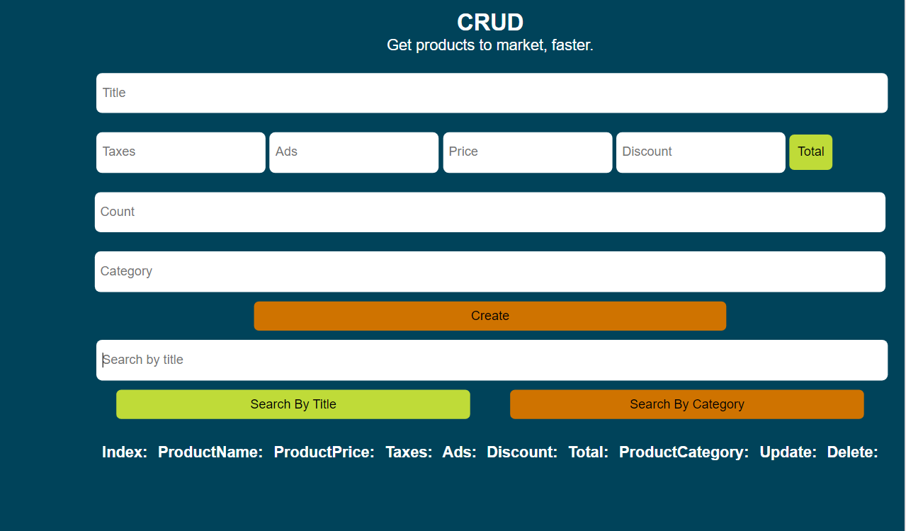

# Recipe Page

Crud app is an application let you add your product and if more opction it is sum total of price for product and you can search with about any product with name of product or category and build more option let you uplaod data fof any product or delet the product from list and we dont forget use locastorage to storage your data.

<br>
<br>
<a href="https://ahmed-abo-rafat.github.io/crud/">
  
</a>

<br>

## Live Site:

- Link: https://ahmed-abo-rafat.github.io/crud/

## Features

- get the total of price: building function to sum total of price for the product.
- Delete and Update the product: Building feature update and delete the product to make user ecpernice mor easy to updata and delete the product from the list of products.
- search about the product: building fuction to seach about the product with with name , category of products.
- Save data in localstorage: saving data in the localstorge is the most feature importat to sve the data for the user.

## Technologies

Project is created with:

- HTML
- CSS
- Javascript
- Localstorage

### What I learned

The best thing i learned from this project how to search in the list of product with different options by name or category of product as you see in the code be.

```js
function searchData(value) {
  let table = "";
  for (let i = 0; i < allProducts.length; i++) {
    if (searchMood == "title") {
      if (allProducts[i].title.includes(value.toLowerCase())) {
        table += `<tr>
                      <td>${i}</td>
                      <td>${allProducts[i].title}</td>
                      <td>${allProducts[i].price}</td>
                      <td>${allProducts[i].taxes}</td>
                      <td>${allProducts[i].ads}</td>
                      <td>${allProducts[i].discount}</td>
                      <td>${allProducts[i].total}</td>
                      <td>${allProducts[i].category}</td>
                      <td><button onclick="updateData(${i})" id="update">Update</button></td>
                      <td><button onclick="deleteData(${i})" id="delete">Delete</button></td>
                  </tr>`;
      }
    } else {
      if (allProducts[i].category.includes(value.toLowerCase())) {
        table += `<tr>
                  <td>${i}</td>
                  <td>${allProducts[i].title}</td>
                  <td>${allProducts[i].price}</td>
                  <td>${allProducts[i].taxes}</td>
                  <td>${allProducts[i].ads}</td>
                  <td>${allProducts[i].discount}</td>
                  <td>${allProducts[i].total}</td>
                  <td>${allProducts[i].category}</td>
                  <td><button onclick="updateData(${i})" id="update">Update</button></td>
                  <td><button onclick="deleteData(${i})" id="delete">Delete</button></td>
              </tr>`;
      }
    }
  }
  document.getElementById("tbody").innerHTML = table;
}
```

## Contact Us

- Website - [Ahmed Rafat](https://ahmed-abo-rafat.github.io/Portfolio/)
- Linked In - [Ahmed Rafat](https://www.linkedin.com/in/ahmed-rafat-a489301a2/)
- Gmail - [Ahmed Rafat](https://mail.google.com/mail/u/1/#inbox)
- Phone - (01060843933)
